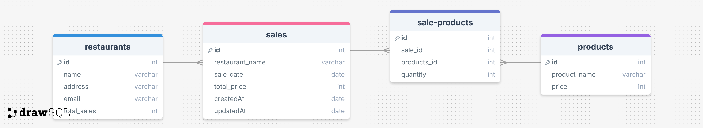

# How to Set Up the API Database

This document guides you through setting up the Database for the API. This guide assumes that you have MySQL installed on your system.

---


## Database Setup

### Database Structure

The API uses two tables: `products` and `sales`. Below is the database schema:



### Creating the Tables

To set up the database with the required structure, copy and paste the SQL code below into your preferred database editor or commandline. You need to create the products table before the sales table.t

#### Create `products` Table
```sql
CREATE TABLE `products` (
  `id` int unsigned NOT NULL AUTO_INCREMENT,
  `product_name` varchar(255) NOT NULL,
  `price` smallint NOT NULL,
  `createdAt` datetime NOT NULL DEFAULT CURRENT_TIMESTAMP,
  `updatedAt` datetime NOT NULL DEFAULT CURRENT_TIMESTAMP,
  PRIMARY KEY (`id`)
);
```

#### Create `sales` Table
```sql
CREATE TABLE `sales` (
  `id` int unsigned NOT NULL AUTO_INCREMENT,
  `restaurant_name` varchar(255) NOT NULL,
  `product_id` int unsigned NOT NULL,
  `quantity` smallint NOT NULL,
  `createdAt` datetime NOT NULL DEFAULT CURRENT_TIMESTAMP,
  `updatedAt` datetime NOT NULL DEFAULT CURRENT_TIMESTAMP ON UPDATE CURRENT_TIMESTAMP,
  PRIMARY KEY (`id`),
  KEY `sales_product_id_foreign` (`product_id`),
  CONSTRAINT `sales_product_id_foreign` FOREIGN KEY (`product_id`) REFERENCES `products` (`id`)
);
```

## Notes
- The `createdAt` and `updatedAt` fields are managed automatically using MySQL’s timestamp functionality.

---

[Back to README](../README.md)
