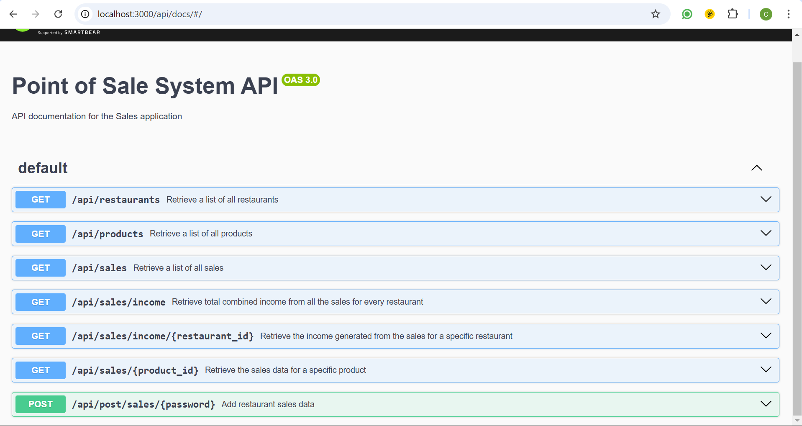

## API Endpoints Documentation

### Base URL
The main API endpoint is as follows:  
Replace `<ipaddress>` and `<port>` with the IP address and the port of the machine where the API is running.

```
<ipaddress>:<port>/api/
```

---

### **GET Endpoints**

#### 1. **Get API Docs**  
**URL:** `/api/docs`  
**Description:** This endpoint provides interactive documentation for the API. It includes a complete list of available endpoints, their request parameters, and response formats. You can also use this documentation to test the endpoints directly within the interface.  

**Response Format:**  
A web-based interface displaying the available endpoints, their descriptions, request parameters, response formats, and interactive tools for making API requests. 



#### 2. **Get All Products**
**URL:** `/api/products`  
**Description:** Retrieves a list of all products from the database.  
**Response Format:**  
```json
[
    {
        "id": 1,
        "product_name": "Coffee",
        "price": 25
    },
    {
        "id": 2,
        "product_name": "Pasta Carbonara",
        "price": 170
    }
]
```

---

#### 3. **Get All Sales**
**URL:** `/api/sales`  
**Description:** Retrieves a list of all sales from the database.  
**Response Format:**  
```json
[
    {
        "sale_id": 1,
        "product_name": "Coffee",
        "quantity": 10
    },
    {
        "sale_id": 2,
        "product_name": "Pasta Carbonara",
        "quantity": 5
    }
]
```

---

#### 4. **Get Sales for a Specific Product**
**URL:** `/api/sales/:product_id`  
**Description:** Retrieves sales data for a specific product by its `product_id`.  
**Example Request:** `/api/sales/1`  
**Response Format:**  
```json
{
  "salesWithProductName": [
    {
      "sale_id": 2,
      "product_name": "Garlic Bread",
      "quantity": 10
    }
  ]
}
```

---

#### 5. **Get Total Sales**
**URL:** `/api/sales/income`  
**Description:** Calculates and retrieves the total income across all restaurants.  
**Response Format:**  
```json
{
  "total_income": "163 SEK"
}
```

---

#### 6. **Get Total Sales for a Specific Restaurant**
**URL:** `/API/sales/income:restaurant_name`  
**Description:** Retrieves total income for a specific restaurant.  
**Example Request:** `/API/sales/income/Restaurant%20A`  
**Response Format:**  
```json
{
  "total_income": "100 SEK for restaurant Pasta Paradise"
}
```

---

#### 7. **Get all restaurants**
**URL:** `/API/restaurants`
**Description:** Retrieves a list of all restaurants and restaurant information.  
**Response Format:**
```json
[
  {
    "id": 1,
    "name": "Pasta Paradise",
    "address": "123 Noodle St, Foodville",
    "email": "contact@pastaparadise.com",
    "total_sales": 100
  },
  {
    "id": 2,
    "name": "Burger Town",
    "address": "456 Patty Lane, Burger City",
    "email": "info@burgertown.com",
    "total_sales": 63
  }
]
```

---

### **POST Endpoint**

#### **Add Sales Data**
**URL:** `/api/post/sales/:password`  
**Description:** Adds sales data for a restaurant. The request must include a valid password and the sales data in the request body.  
**Authentication:** The `:password` parameter must match the value of `POST_PASSWORD` in the environment variables.  

**Example Request:**  
**URL:** `/api/post/sales/securepassword`  
**Request Body:**  
```json
[
    {
        "restaurant_name": "Pasta Paradise",
        "address": "123 Noodle St, Foodville",
        "email": "contact@pastaparadise.com",
        "product_name": "Spaghetti Bolognese",
        "price": 12.99,
        "quantity": 5
    },
    {
        "restaurant_name": "Pasta Paradise",
        "address": "123 Noodle St, Foodville",
        "email": "contact@pastaparadise.com",
        "product_name": "Garlic Bread",
        "price": 3.50,
        "quantity": 10
    },
    {
        "restaurant_name": "Burger Town",
        "address": "456 Patty Lane, Burger City",
        "email": "info@burgertown.com",
        "product_name": "Cheeseburger",
        "price": 8.99,
        "quantity": 7
    }
]
```

**Response:**  
  ```
  Sales data processed successfully!
  ```

---

### **Notes**
- Ensure the database connection details and environment variables are correctly configured in the `.env` file.  
- The POST endpoint is password-protected to prevent unauthorized access. 

---

[Back to README](../README.md)
