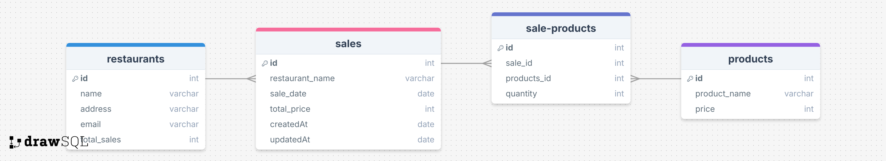

# How to Set Up the API and Database

This document guides you through setting up the API and its database structure.

---

## API Setup

To set up the API:
1. Ensure you have all dependencies installed by running:
   ```bash
   npm install
   ```
2. Configure your environment variables in a `.env` file. See the [`.env.example`](../API/.env.example) for reference.

3. Start the API by running the following command in your terminal:
   ```bash
   node app.js
   ```
   This will launch the API and make it accessible on the configured ip and port. To see al. the endpoint [ApiEndpoints](/Documents/ApiEndpoints.md) see.

---

## Database Setup

### Database Structure

The API uses two tables: `products` and `sales`. Below is the database schema:



### Creating the Tables

To set up the database with the required structure, copy and paste the SQL code below into your preferred database editor:

#### Create `products` Table
```sql
CREATE TABLE `products` (
  `id` int unsigned NOT NULL AUTO_INCREMENT,
  `product_name` varchar(255) NOT NULL,
  `price` smallint NOT NULL,
  `createdAt` datetime NOT NULL DEFAULT CURRENT_TIMESTAMP,
  `updatedAt` datetime NOT NULL DEFAULT CURRENT_TIMESTAMP,
  PRIMARY KEY (`id`)
);
```

#### Create `sales` Table
```sql
CREATE TABLE `sales` (
  `id` int unsigned NOT NULL AUTO_INCREMENT,
  `restaurant_name` varchar(255) NOT NULL,
  `product_id` int unsigned NOT NULL,
  `quantity` smallint NOT NULL,
  `createdAt` datetime NOT NULL DEFAULT CURRENT_TIMESTAMP,
  `updatedAt` datetime NOT NULL DEFAULT CURRENT_TIMESTAMP ON UPDATE CURRENT_TIMESTAMP,
  PRIMARY KEY (`id`),
  KEY `sales_product_id_foreign` (`product_id`),
  CONSTRAINT `sales_product_id_foreign` FOREIGN KEY (`product_id`) REFERENCES `products` (`id`)
);
```

---

## Setting Up the `.env` File

To correctly configure the `.env` file used by the API:
1. Follow the structure provided in the [`.env.example`](../API/.env.example).
2. Ensure all variables such as database credentials and API-specific configurations are set.

---

## Notes
- The `createdAt` and `updatedAt` fields are managed automatically using MySQL’s timestamp functionality.
- Double-check your database connection details in the `.env` file before running the API.
