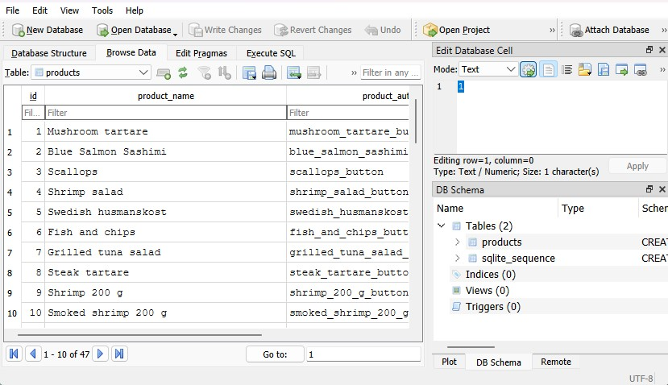

## Database System
This program uses an SQLite-based database solution.

### Database Initialization
When the program is started for the first time, it creates a `database.db` file in the user's `C\:Users\<username>\AppData\Local\Restaurant Point of Sale System` directory.

### Menu Items
The database table `products` contains information about the menu items.
It initially gets created from [this](../PointOfSaleSystem/PointOfSaleSystem/InitialProductsData.txt) `.txt` file if the table does not yet exist (i.e. when [the program is first run](#database-initialization)).

Each entry in the file is placed under one of the following categories:

1. Starters
2. Main courses
3. Seafood
4. Pizza
5. Desserts
6. Sauces
7. Wines
8. Draft Beer
9. Bottled Beer
10. Cider
11. Coffee

> **Note:**  Each item is added to the table with its corresponding category. The order of categories in the text file determines the priority, with items from categories listed earlier in the file having higher priority. For example, Starters will always have higher priority than Pizza or Desserts because they appear earlier in the file. Items with higher priority are displayed before those with lower priority in the UI.

To add a new default menu item, add the name of the product and price under desired category in this format:

```
Chocolate mousse,90
```

To update the database with the new data the table then needs to be deleted and recreated.
This can be done either by deleting the whole database file at [its location](#database-initialization), or deleting the table through a tool like DB Browser (as mentioned in [this section](#deleting-a-table)) and then rerunning the program.

### Viewing and Changing the Database
Instead of directly changing the default data that the database uses during initialization, it is possible to directly interact with the database once it has been created using DB Browser.

#### Downloading DB Browser
Download and install [DB Browser for SQLite](https://sqlitebrowser.org/dl/), a GUI program that will allow you to easily view and change the database.



#### Viewing a Table
* Open or drag and drop the `database.db` file from [its location](#database-initialization) into DB Browser

* Once the database is loaded, go to the **Browse Data** tab

* To view a specific table (e.g., `orders`, `order_details`, or `products`), select the desired table in the dropdown on the left side of the toolbar

#### Add to a Table
* To add a new menu item to the `products` table, run the following inside of the **Execute SQL** tab after switching out the template entries to the desired data:

    ```SQL
    INSERT INTO products (product_name, product_automation_id, price, category_id) VALUES ("Chocolate mousse", "chocolate_mousse_button", 90, 5);
    ```

* Afterwards, press Ctrl+Return or click the playhead icon in the toolbar, and then click on **Write Changes** to update the database

#### Deleting a Table
To delete a table in the database, while in the **Database Structure** tab, right click on the table name in the tree structure and select **Delete Table** and then click on **Write Changes**.

#### Exporting Table Data
* Go to the **Browse Data** tab

* Select the table you want to export in the dropdown on the left side of the toolbar

* Find and click on the icon located in around the middle of the toolbar that displays "Save table as currently displayed" when hovered over

* Choose which format you want to export to (CSV, JSON)

---

[Back to README](../README.md)