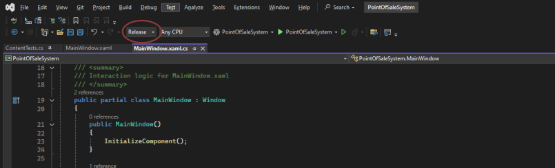

## Automatic Testing System

Inside of Visual Studio we use a testing system for testing the contents and behaviour of our application.
The sub-project `TestSystem` inside of the main `PointOfSaleSystem` project contains the tests for the project.

Follow these instructions to run the tests:

* First make sure your are set to build a release version of the project by setting the value of the dropdown shown here:

* Ensure that you have a clean release solution build in Visual Studio by navigating to Build->Clean Solution.
* Build a new release from the solution by navigating to Build->Build Solution.
* To run the tests in Visual Studio, first open the Test Explorer from View->Test Explorer.
* Then click "Run All Tests In View".

---

[Back to README](../README.md)